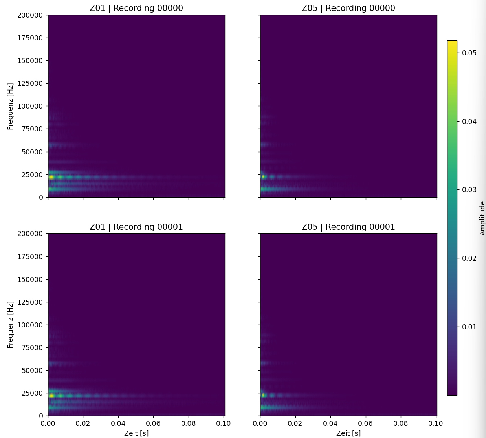
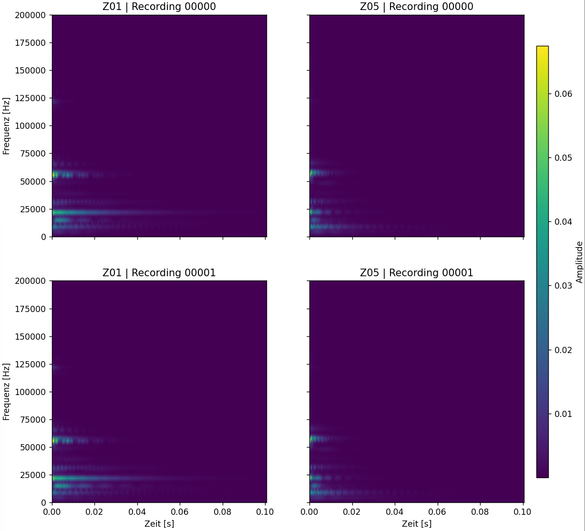
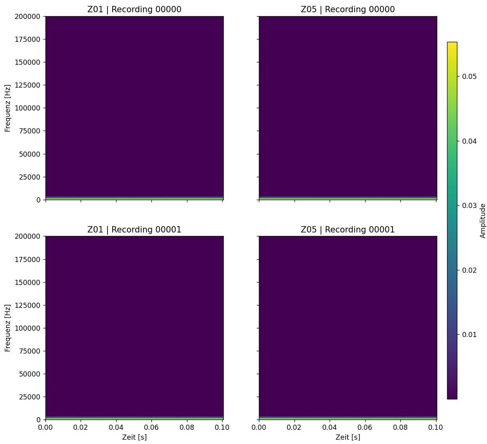

# Project 1:
### Team 3:
Tim Giese, Benjamin Gielczynski, Victor Domke, David von Rüden, Simon Brockhoff

## Presentation of the short-time Fourier transformation:
### Ch1 signals: window-length: 550, overlap: 50%, function: "hann"

### Ch2 signals: window-length: 550, overlap: 50%, function: "hann"

### Wav3 signals: window-length: 550, overlap: 50%, function: "hann"

## Vergleich der Signale:
Die Z01 Signale schwingen Länger, dies lässt sich vorallem in Frequenzen von 0 - 25000 Hz sehen. Außerdem erkennt man bei Z05, dass die Signale eher gestreckt sind im Vergleich zu Z01.

## Identifizieren des defekten Zahnrades:
Anhand des Vergleichs der Signale können wir erkennen, dass bei Z05 ein Defekt vorliegen muss, da das Signal eine verkürzte Schwingungdauer aufweist, also demnach über ein schnelleres Abklingverhalten verfügt, dies lässt die Annahme zu das die Schwingungen von etwas unterbrochen werden.

