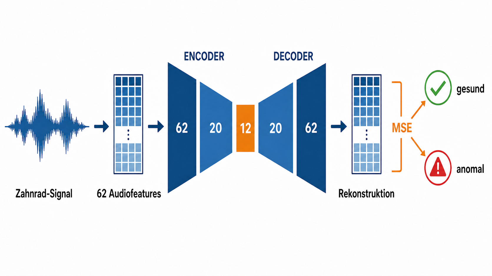
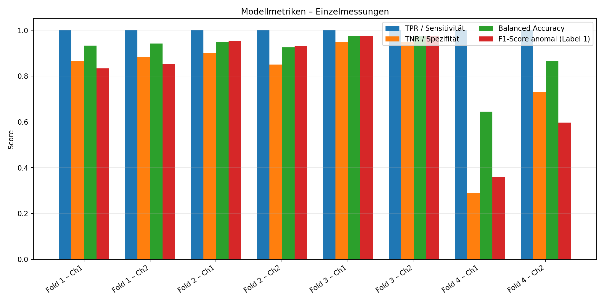
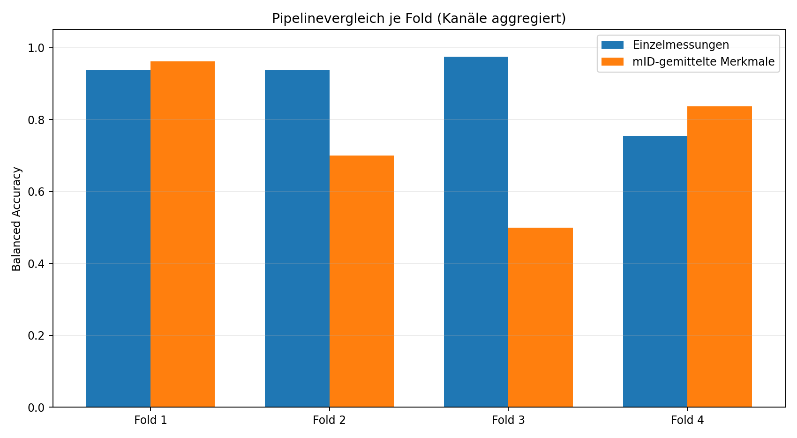
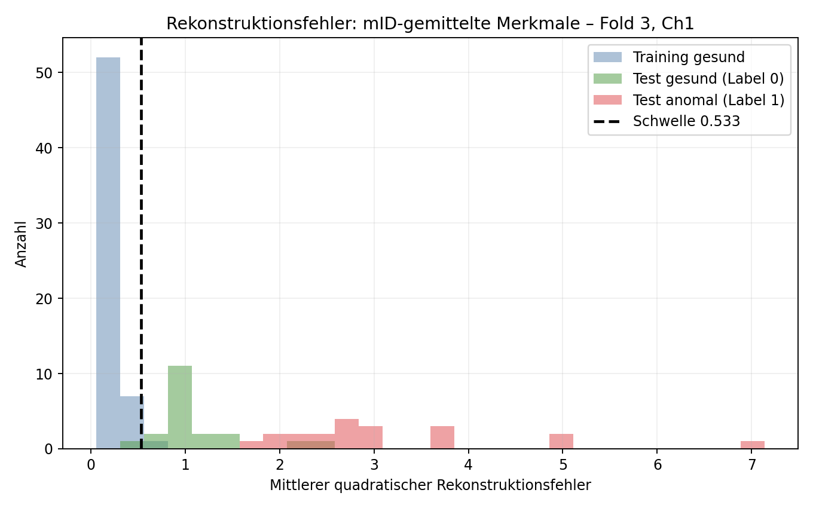

# Gliederung

**Task 4: Ein-Klassen-Klassifikation von Zahnrad-Audiosignalen**

1. Daten und zwei Vorverarbeitungen
2. Kreuzvalidierung und Autoencoder
3. Entscheidung und Metriken
4. Ergebnisse und Pipelinevergleich
5. Diskussion und Fazit

**Umfang:** zwei Pipelines x vier Splits x zwei Kanaele = 16 Autoencoder

<!--
Notizen - 30 Sekunden:
Zuerst stellen wir Daten und Versuchsaufbau vor. Danach erklaeren wir Modell und
Metriken, vergleichen beide Vorverarbeitungen und schliessen mit der fachlichen
Einordnung. Der Vortrag ist auf etwa neun Minuten und dreissig Sekunden ausgelegt.
-->

---

# Daten & Pipelines

- Z01-Z04: **gesund (Label 0)**; Z05: **anomal (Label 1)**
- 440 WAV-Dateien, 62 Audiofeatures je Datei
- Ch1 und Ch2 werden getrennt modelliert

| Pipeline | Verarbeitung nach Feature-Extraktion | Samples |
|---|---|---:|
| Einzelmessung | keine Mittelung | 440 |
| mID-gemittelt | Mittel je `spec`, `pos`, `rID`, Kanal | 200 |

Nach Mittelung besitzt jede Z-Gruppe genau 20 Samples je Kanal. Z01 fasst je
gemitteltem Sample 5 mIDs, Z04 3 mIDs zusammen; Z02, Z03 und Z05 besitzen nur
eine mID.

<!--
Notizen - 55 Sekunden:
Die Feature-Extraktion wird immer vor der Mittelung ausgefuehrt. Dadurch mitteln
wir Merkmalsvektoren und nicht Rohsignale. Die Mittelung veraendert nur Z01 und
Z04; die anderen Gruppen bleiben inhaltlich unveraendert.
-->

---

# Kreuzvalidierung

| Fold | Gesundes Training | Test: gesund | Test: anomal |
|---|---|---|---|
| 1 | Z01, Z02, Z03 | Z04 | Z05 |
| 2 | Z01, Z02, Z04 | Z03 | Z05 |
| 3 | Z01, Z03, Z04 | Z02 | Z05 |
| 4 | Z02, Z03, Z04 | Z01 | Z05 |

Pro Pipeline und Fold werden zwei Modelle trainiert: Ch1 und Ch2. Z05 und die
jeweils ausgelassene gesunde Gruppe beeinflussen weder Skalierung noch Training
oder Schwellenwert.

<!--
Notizen - 50 Sekunden:
Die aeusseren Splits entsprechen exakt der Aufgabenstellung. Jeder gesunde
Zustand wird einmal als unbekannte gesunde Gruppe getestet. Z05 wird in jedem
Fold erneut ausgewertet.
-->

---

# Autoencoder

**Identisch fuer alle 16 Modelle:** ReLU, Adam, Early Stopping, Seed 42;
Training ausschliesslich mit gesunden Daten (Label 0).

<!--
Notizen - 55 Sekunden:
Aus dem Zahnrad-Signal entstehen 62 Audiofeatures. Der Encoder komprimiert diese
ueber 20 auf 12 Werte; der Decoder rekonstruiert den Merkmalsvektor. Ein grosser
MSE weist auf eine Anomalie hin. Alle Hyperparameter bleiben zwischen den
Pipelines gleich, und die Skalierung wird je Trainingsfold neu gelernt.
-->

---

# Metriken & Schwelle

**Anomaliescore:** mittlerer quadratischer Rekonstruktionsfehler im
standardisierten Merkmalsraum

**Schwelle:** 98%-Quantil der Fehler im gesunden Training

- Klassenkonvention: anomal/Z05 = Label 1 (positiv), gesund = Label 0 (negativ)
- oberhalb der Schwelle: anomal (Label 1)
- keine Verwendung der Anomalieklasse (Z05) zur Schwellenoptimierung
- True Positive Rate (TPR, Sensitivität/Recall): $TP/(TP+FN)$ für anomal (Label 1)
- True Negative Rate (TNR, Spezifität): $TN/(TN+FP)$ für gesund (Label 0)
- Accuracy, Balanced Accuracy (BA), F1-Score und ROC-AUC für die positive
  Anomalieklasse (Label 1)

**Primaerer Vergleich:** Makromittel der BA ueber alle acht Modelle, weil die
ungemittelte Pipeline ungleiche Testgruppengroessen besitzt.

<!--
Notizen - 60 Sekunden:
Ein gepoolter Vergleich allein waere unfair: Ohne Mittelung hat Fold 4 wegen
Z01 besonders viele Testzeilen. BA gleicht Klassen aus; das Makromittel gibt
zusaetzlich jedem der acht Modelle dasselbe Gewicht. Das 98%-Quantil setzt eine
konservativere Schwelle: Es reduziert Fehlalarme, kann aber einzelne Anomalien
uebersehen. Z05 wird nicht zur Wahl der Schwelle verwendet.
-->

---

# Einzelmessungen

| Fold, Ch1 / Ch2 | TPR / Sensitivität | TNR / Spezifität | BA |
|---|---:|---:|---:|
| 1 | 1,000 | 0,867 / 0,883 | 0,933 / 0,942 |
| 2 | 1,000 | 0,900 / 0,850 | 0,950 / 0,925 |
| 3 | 1,000 | 0,950 / 0,950 | 0,975 / 0,975 |
| 4 | 1,000 | 0,290 / 0,730 | 0,645 / 0,865 |

<!--
Notizen - 65 Sekunden:
Alle 16 Modelle erreichen eine Sensitivität von 1,000; es treten keine False
Negatives der Anomalieklasse auf. Fold 1 bis 3 sind insgesamt gut. In Fold 4
unterscheiden sich Ch1 und Ch2 deutlich; besonders Ch1 erzeugt viele False
Positives der gesunden Z01-Testgruppe.
-->

---

# Pipelinevergleich

| BA, Kanaele gepoolt | Einzelmessung | mID-gemittelt |
|---|---:|---:|
| Fold 1 | 0,938 | **0,963** |
| Fold 2 | **0,938** | 0,700 |
| Fold 3 | **0,975** | 0,500 |
| Fold 4 | 0,755 | **0,838** |
| Makromittel 8 Modelle | **0,901** | 0,750 |

TPR/Sensitivität in beiden Pipelines und allen Modellen: **1,000**.

<!--
Notizen - 75 Sekunden:
Die Mittelung ist kein genereller Gewinn. Sie verbessert Fold 1 leicht und Fold 4
deutlich, verschlechtert aber Fold 2 und besonders Fold 3. Im fairen Modellmakro
bleibt die Einzelmessung mit 0,901 gegenueber 0,750 klar vorne.
-->

---

# Effekt der mID-Mittelung

- Fold 4 profitiert: mID-Variation von Z01 wird geglaettet
- Fold 1 verbessert sich leicht auf BA 0,963; Fold 2 faellt auf BA 0,700
- Fold 3 verschlechtert sich: Z02 bleibt im Test ungemittelt; im Training werden
  Z01 und Z04 geglaettet, Z03 dagegen nicht
- Fold 3 TNR/Spezifität: Ch1 **0,000**, Ch2 **0,000**
- Die Mittelung veraendert damit die Definition des gelernten Normalzustands

<!--
Notizen - 75 Sekunden:
Die gruene Verteilung ist gesundes Z02, liegt aber fast komplett rechts von der
Schwelle. Das Training mischt geglaettete Z01- und Z04-Samples mit ungemitteltem
Z03. Ungemitteltes Z02 wirkt relativ dazu neu. Der Autoencoder erkennt erneut
Verteilungsabweichung, nicht direkt die Schadensursache.
-->

---

# Diskussion

- **Hohe Sensitivität:** beide Pipelines erreichen gepoolt eine TPR von **1,000**
- **Einzelmessung:** deutlich bessere Makro-BA und robust in Fold 2/3
- **mID-Mittelung:** weniger Z01/Z04-Variation, bessere Folds 1/4 und hoehere
  gepoolte AUC von 0,977
- **Risiko der Mittelung:** inkonsistente Vorverarbeitung, weil nur Z01 und Z04
  mehrere mIDs besitzen
- **Grenze:** Die 98%-Trainingsschwelle generalisiert nicht immer auf eine neue
  gesunde Z-Gruppe

Naechster Schritt: gruppenbasierte Schwellenkalibrierung und Vergleich mit einer
One-Class SVM; beide Pipelines sollten als Ablationsvergleich erhalten bleiben.

<!--
Notizen - 55 Sekunden:
Das Ergebnis spricht nicht dafuer, Mittelung grundsaetzlich zu verbieten. Es
zeigt aber, dass die Zahl der mIDs mit der Z-Gruppe gekoppelt ist. Dadurch kann
die Mittelung einen Fold verbessern und einen anderen verschlechtern.
-->

---

# Fazit: Einzelmessungen

Ch1 und Ch2 werden fuer die Bewertung je Fold gepoolt.

| Fold (gesunder Test) | TPR | TNR | Accuracy | BA | F1 |
|---|---:|---:|---:|---:|---:|
| 1 (Z04) | 1,000 | 0,875 | 0,906 | 0,938 | 0,842 |
| 2 (Z03) | 1,000 | 0,875 | 0,938 | 0,938 | 0,941 |
| **3 (Z02) - bestes** | **1,000** | **0,950** | **0,975** | **0,975** | **0,976** |
| **4 (Z01) - schlechtestes** | **1,000** | **0,510** | **0,592** | **0,755** | **0,449** |

**ROC-Hinweis:** Fold 2 erreicht in Ch1 und Ch2 jeweils **ROC-AUC 1,000**.

## Kernaussage

**Alle vier Fold-Modelle erkennen die Anomalien vollständig. Die Unterschiede
entstehen durch False Positives bei den unbekannten gesunden Gruppen.**

<!--
Notizen - 50 Sekunden:
Fuer die Schlussbewertung poolen wir beide Kanaele und betrachten die vier
Fold-Konfigurationen getrennt. Fold 3 ist mit einer Balanced Accuracy von 0,975
das beste Ergebnis. Fold 4 ist mit 0,755 das schlechteste, weil die unbekannte
gesunde Gruppe Z01 98 False Positives verursacht. Fold 2 erreicht in beiden
Kanaelen eine ROC-AUC von 1,000: Die Score-Rangfolge trennt die Klassen perfekt,
am festen Schwellenwert entstehen aber zwei beziehungsweise drei False Positives.
Die Kreuzvalidierung waehlt nicht automatisch ein finales Einsatzmodell; dafuer
wuerde anschliessend auf allen gesunden Gruppen neu trainiert. Gesamte Sprechzeit:
etwa 9:30 Minuten.
-->
