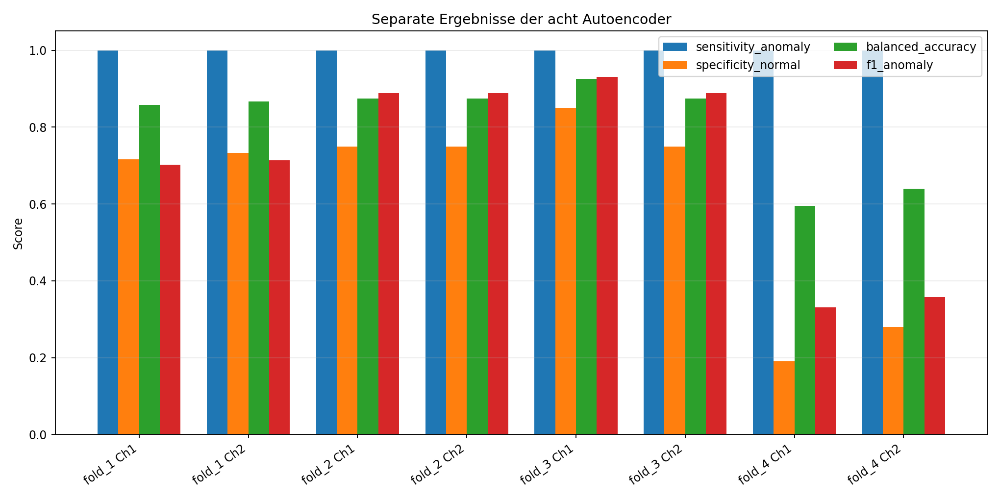
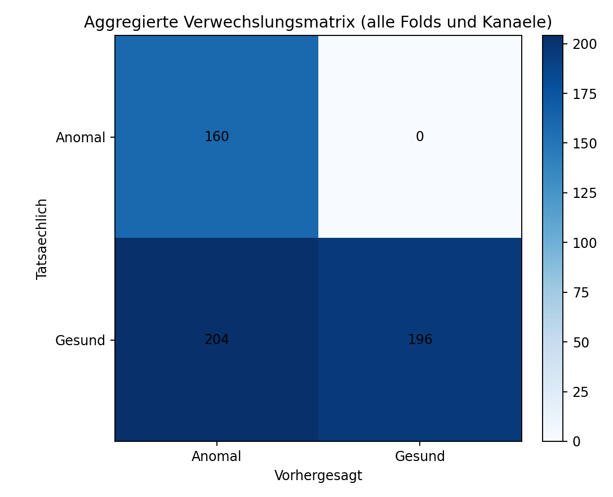
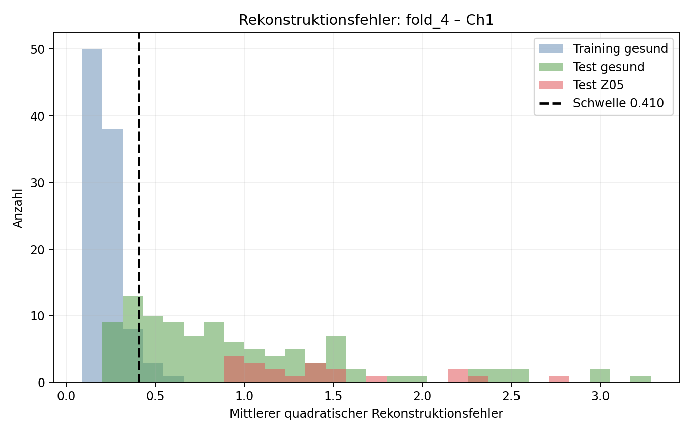

# Task 4

## Anomalieerkennung mit Ein-Klassen-Autoencodern

**Vier Leave-P-Groups-Out-Splits × zwei Audiokanaele = acht Modelle**

Kernaussage: Z05 wird vollstaendig erkannt, aber ein unbekannter gesunder
Zustand kann ebenfalls wie eine Anomalie aussehen.

<!--
Notizen – 35 Sekunden:
Wir zeigen eine echte Ein-Klassen-Klassifikation: Trainiert wird nur mit gesunden
Zahnraedern. Der wichtigste Befund ist nicht nur die perfekte Erkennung von Z05,
sondern der Zielkonflikt zwischen Sensitivitaet und Fehlalarmen bei unbekannten
gesunden Zahnraedern.
-->

---

# Datenbasis und Labels

- Gleicher Audiodatensatz wie in Task 2 und 3
- Z01–Z04: **gesund (Label 1)**; Z05: **anomal (Label 0)**
- Ch1 und Ch2 werden durch getrennte Modelle verarbeitet
- Keine Mittelung ueber `mID`: jede WAV-Datei ist ein Sample
- 440 Samples insgesamt, 220 je Kanal
- 62 Merkmale je Sample: MFCC, Spektral-, Chroma-, ZCR-, RMS- und Delta-MFCC-Merkmale

| Gruppe | Samples je Kanal | Rolle |
|---|---:|---|
| Z01 | 100 | gesund |
| Z02 | 20 | gesund |
| Z03 | 20 | gesund |
| Z04 | 60 | gesund |
| Z05 | 20 | anomal, nur Test |

<!--
Notizen – 55 Sekunden:
Die nicht gemittelten Daten erhalten besonders bei Z01 und Z04 die Variation
zwischen Mess-IDs. Z02, Z03 und Z05 besitzen jeweils nur eine mID, daher hatte
die fruehere Mittelung dort praktisch keinen Reduktionseffekt. Die ungleichen
Gruppengroessen machen Accuracy allein ungeeignet.
-->

---

# Vorgegebene Kreuzvalidierung

| Fold | Gesundes Training | Test: gesund | Test: anomal |
|---|---|---|---|
| 1 | Z01, Z02, Z03 | Z04 | Z05 |
| 2 | Z01, Z02, Z04 | Z03 | Z05 |
| 3 | Z01, Z03, Z04 | Z02 | Z05 |
| 4 | Z02, Z03, Z04 | Z01 | Z05 |

Pro Fold werden zwei Modelle trainiert: eines fuer Ch1 und eines fuer Ch2.
Z05 und die jeweils ausgelassene gesunde Gruppe beeinflussen weder Skalierung,
Training noch Schwellenwert.

<!--
Notizen – 60 Sekunden:
Das ist exakt die Leave-P-Groups-Out-Struktur aus der Aufgabenstellung. Jeder
gesunde Z-Zustand ist einmal die unbekannte gesunde Testgruppe. Z05 wird in
jedem Fold erneut getestet; deshalb unterscheiden wir spaeter Modellmittelwerte
von gepoolten Einzelentscheidungen.
-->

---

# Modell und Verarbeitung

```text
WAV → 62 Features → StandardScaler → 32 → 8 → 32 → 62
                                         Engpass
                      Rekonstruktionsfehler (MSE) → Schwelle → Label
```

- `MLPRegressor` als dichter Autoencoder, ReLU, Adam
- Lernrate 0,001; L2-Regularisierung 0,0001
- maximal 2.000 Epochen, Early Stopping mit 15 % der gesunden Trainingsdaten
- feste Architektur und Seed 42 fuer alle acht Modelle

**Begruendung:** Der Engpass mit 8 Neuronen muss die Struktur gesunder Samples
komprimieren. Unbekannte Muster sollten schlechter rekonstruiert werden.

<!--
Notizen – 65 Sekunden:
Alle Features werden nur anhand des jeweiligen gesunden Trainingssatzes
standardisiert. Die feste Architektur verhindert, dass wir acht Modelle
nachtraeglich auf die Testdaten optimieren. 32-8-32 ist bewusst kompakt gegenueber
62 Eingaben; Early Stopping reduziert Ueberanpassung bei kleinen Folds.
-->

---

# Entscheidung und Metriken

**Anomaliescore:** mittlerer quadratischer Rekonstruktionsfehler im
standardisierten Merkmalsraum

**Schwelle:** 95%-Quantil der Rekonstruktionsfehler im gesunden Training

- rein ein-klassig: keine Z05-Labels zur Schwellenoptimierung
- erwartete Trainings-Fehlalarmrate von etwa 5 %
- Fehler oberhalb der Schwelle → anomal (Label 0)

Bewertung: Verwechslungsmatrix, Sensitivitaet fuer Anomalien, Spezifitaet fuer
Gesund, Accuracy, Balanced Accuracy (BAR), F1 und zusaetzlich ROC-AUC.

<!--
Notizen – 55 Sekunden:
Das 95%-Quantil ist nachvollziehbar und robust gegen einzelne Ausreisser. Eine
groessere Schwelle wuerde Fehlalarme senken, kann aber Defekte uebersehen. BAR ist
der Mittelwert aus Sensitivitaet und Spezifitaet und deshalb bei den stark
ungleichen Testgroessen zentral.
-->

---

# Separate Ergebnisse: acht Modelle



| Bereich | Sensitivitaet | Spezifitaet | BAR |
|---|---:|---:|---:|
| Fold 1, Ch1 / Ch2 | 1,000 | 0,717 / 0,733 | 0,858 / 0,867 |
| Fold 2, Ch1 / Ch2 | 1,000 | 0,750 / 0,750 | 0,875 / 0,875 |
| Fold 3, Ch1 / Ch2 | 1,000 | 0,850 / 0,750 | 0,925 / 0,875 |
| Fold 4, Ch1 / Ch2 | 1,000 | 0,190 / 0,280 | 0,595 / 0,640 |

<!--
Notizen – 80 Sekunden:
Alle acht Modelle finden alle Z05-Beispiele. In Fold 1 bis 3 liegt die BAR
zwischen 0,858 und 0,925. Fold 4 bricht deutlich ein. Der Einbruch liegt nicht
an verpassten Defekten, sondern ausschliesslich an gesunden Z01-Samples, die als
anomal gemeldet werden. Ch1 und Ch2 zeigen denselben Grundtrend.
-->

---

# Aggregierte Ergebnisse



| Aggregation | Sens. | Spez. | Accuracy | BAR | F1 | AUC |
|---|---:|---:|---:|---:|---:|---:|
| 560 Testentscheidungen | 1,000 | 0,490 | 0,636 | 0,745 | 0,611 | 0,909 |
| Makromittel der 8 Modelle | 1,000 | 0,628 | 0,733 | 0,814 | 0,713 | 0,958 |

160/160 Anomalieentscheidungen sind richtig; 204/400 gesunden Entscheidungen
sind Fehlalarme. Z05 erscheint vorgabegemaess in jedem Fold.

<!--
Notizen – 60 Sekunden:
Die gepoolte Matrix gewichtet grosse Testgruppen staerker, insbesondere die 100
Z01-Samples je Kanal in Fold 4. Das Makromittel behandelt jedes der acht Modelle
gleich und ist daher hoeher. Beide Werte sind korrekt, beantworten aber
unterschiedliche Fragen. Wichtig ist, die 560 Entscheidungen nicht mit 560
einzigartigen Audiodateien zu verwechseln.
-->

---

# Warum ist Fold 4 schwierig?



- Training ohne Z01: nur 100 gesunde Samples aus Z02, Z03 und Z04
- 81/100 gesunden Z01-Samples in Ch1 und 72/100 in Ch2 werden als anomal erkannt
- Median des normierten Z01-Scores: Ch1 **2,00**, Ch2 **1,27**
- Z01 besitzt mehr Messvariation: 5 mIDs und 100 Samples je Kanal
- Z01 und Z05 ueberlappen im Rekonstruktionsfehler

<!--
Notizen – 80 Sekunden:
Die gestrichelte Linie ist die ohne Testdaten bestimmte Schwelle. Links liegt
das bekannte gesunde Training, waehrend das unbekannte gesunde Z01 deutlich nach
rechts verschoben ist. Der Autoencoder erkennt also Neuheit, nicht automatisch
Schaden. Dass Z01 fuenf mIDs umfasst, macht die nicht gemittelte Variation jetzt
sichtbar und erklaert einen Teil des Domain Shifts.
-->

---

# Diskussion und Grenzen

- **Staerke:** keine Defektdaten fuer Training oder Schwellenwahl erforderlich
- **Staerke:** Ch2 ist aggregiert robuster als Ch1 (BAR 0,755 vs. 0,735;
  AUC 0,972 vs. 0,833)
- **Grenze:** Neuheit kann durch Zahnrad-, Mess-ID- oder Kanalunterschiede statt
  durch einen Defekt entstehen
- **Grenze:** nur eine Anomaliegruppe Z05; Generalisierung auf andere Schaeden ist offen
- **Grenze:** 95%-Schwelle ist ein betrieblicher Kompromiss, kein universelles Optimum

Naechste Schritte: mehr gesunde Betriebszustaende, separate Kalibrierdaten,
robuste/physikalisch motivierte Features und Vergleich mit One-Class SVM oder
Isolation Forest.

<!--
Notizen – 65 Sekunden:
Die perfekte Sensitivitaet darf nicht isoliert interpretiert werden. Im Betrieb
waeren die vielen Fehlalarme problematisch. Ch2 trennt die Scores insgesamt
besser, obwohl seine feste Schwellenentscheidung nur leicht besser ist. Fuer
eine belastbare Anwendung braucht man mehr gesunde Variabilitaet und weitere
Defektarten.
-->

---

# Fazit

1. Acht echte Ein-Klassen-Autoencoder wurden entsprechend der Aufgabenstellung trainiert.
2. Z05 wurde in jedem Fold und Kanal erkannt: **Sensitivitaet 1,000**.
3. Fold 1–3 liefern gute BAR-Werte von **0,858 bis 0,925**.
4. Fold 4 zeigt den entscheidenden Risikofall: unbekanntes gesundes Z01 wird oft
   als anomal bewertet.

## Kernaussage

**Der Autoencoder erkennt Abweichung vom bekannten Normalzustand – die fachliche
Zuordnung „Abweichung = Schaden“ braucht ausreichend repraesentative Normaldaten.**

<!--
Notizen – 45 Sekunden:
Damit beantworten wir die Aufgabe: Die Anomalie selbst wird sehr sicher erkannt,
aber die Spezifitaet haengt stark davon ab, ob das gesunde Training die spaetere
Betriebsvariation abdeckt. Anschliessend koennen wir die Wahl der Schwelle und
den Umgang mit Z01 als Diskussionspunkte oeffnen. Gesamte Sprechzeit: ca. 10 min.
-->
